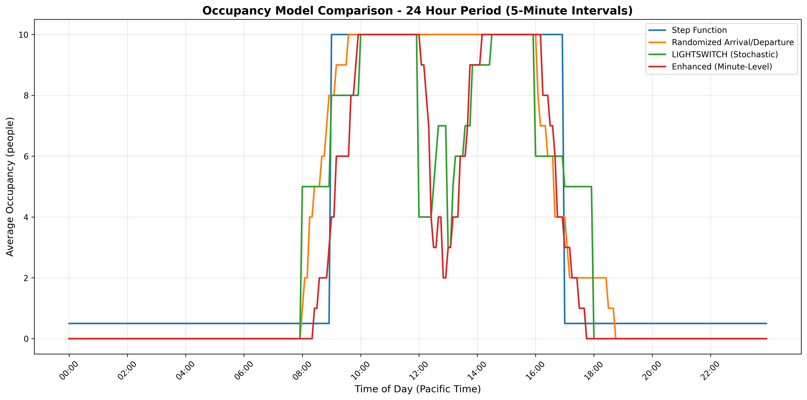

# Occupancy Models

This page documents all occupancy models available in the `smart_control.simulator.occupancy` module.

## Model Comparison

The following chart compares the behavior of all occupancy models over a 24-hour period with 5-minute intervals:



For an interactive version of this chart, see the [interactive occupancy comparison plot](../../assets/plots/occupancy_comparison.html).

The comparison script can be run with:
```bash
python -m smart_control.simulator.occupancy.compare
```

## Enhanced Occupancy

::: smart_control.simulator.occupancy.enhanced_occupancy

## Stochastic Occupancy (LIGHTSWITCH)

::: smart_control.simulator.occupancy.stochastic_occupancy

## Randomized Arrival/Departure Occupancy

::: smart_control.simulator.occupancy.randomized_arrival_departure_occupancy

## Step Function Occupancy

::: smart_control.simulator.occupancy.step_function_occupancy
