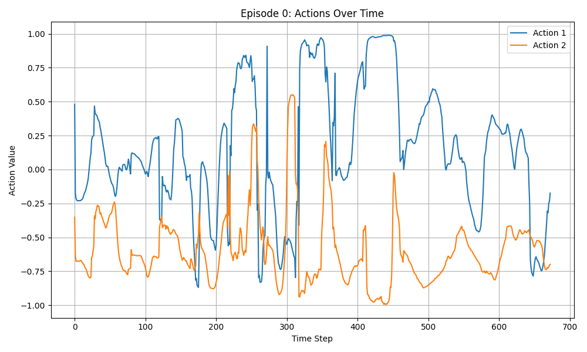
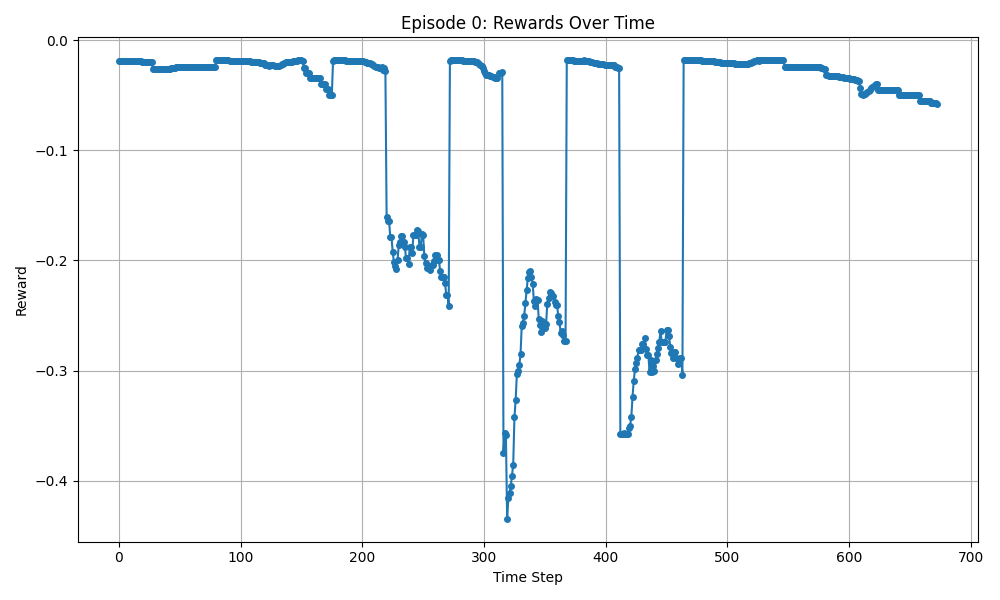
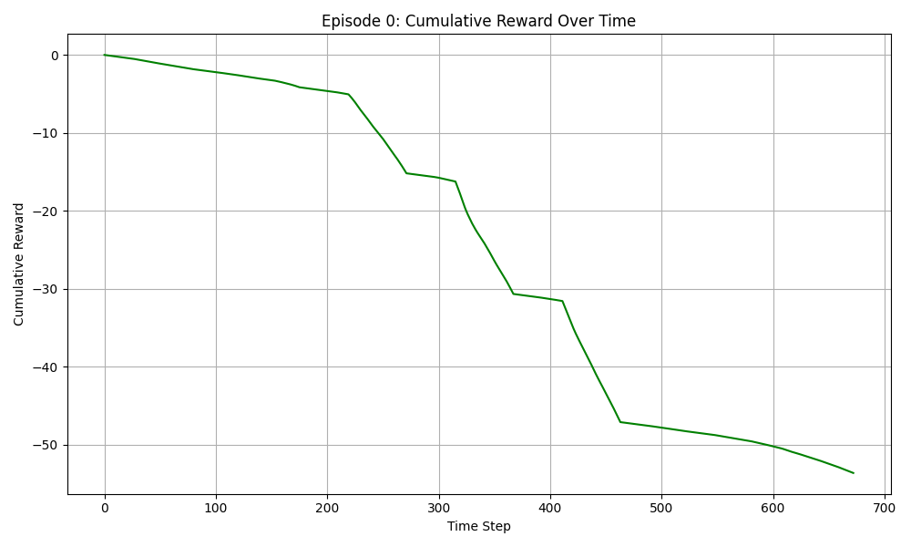

# Visualization

This part of the reinforcement learning module should include tools for visualizing agent behavior, environment states, and performance metrics. These tools help with understanding agent performance, debugging issues, and communicating results.

## TrajectoryPlotter

**Purpose**: Generates plots from trajectory data collected during agent evaluation.

**Implementation**: `TrajectoryPlotter` in `visualization/trajectory_plotter.py`

**Key Methods**:

- **`plot_actions(actions, save_path, timestamps=None, title="Actions Over Time")`**:

  - Visualizes action values over time
  - Shows the agent's control decisions
  - Optionally includes timestamps on the x-axis

- **`plot_rewards(rewards, save_path, timestamps=None, title="Rewards Over Time")`**:

  - Displays reward values at each time step
  - Helps identify when the agent receives high or low rewards
  - Useful for understanding the reward landscape

- **`plot_cumulative_reward(rewards, save_path, timestamps=None, title="Cumulative Reward Over Time")`**:
  - Shows the accumulation of reward over time
  - Provides a clear picture of overall agent performance
  - Useful for comparing different policies

**Usage Example**:

```python
from smart_control.reinforcement_learning.visualization.trajectory_plotter import TrajectoryPlotter

# Generate plots from collected data
TrajectoryPlotter.plot_actions(
    actions=action_data,
    save_path='plots/actions.png',
    timestamps=timestamp_data,
    title='Agent Actions During Evaluation'
)

TrajectoryPlotter.plot_rewards(
    rewards=reward_data,
    save_path='plots/rewards.png',
    title='Agent Rewards'
)

TrajectoryPlotter.plot_cumulative_reward(
    rewards=reward_data,
    save_path='plots/cumulative_reward.png',
    title='Cumulative Reward'
)
```

These methods should produce plots similar to these:







---

[Back to Reinforcement Learning](../reinforcement-learning-module.md)

[Back to Home](../../index.md)
